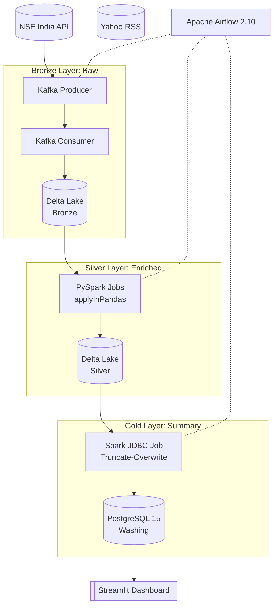

# FinScope: Production NSE Stock Market Pipeline

A professional-grade data engineering project featuring a **Medallion Architecture** (Bronze/Silver/Gold) on a Big Data stack. It handles real-time ingestion from NSE, performs distributed technical analysis using PySpark, and maintains a PostgreSQL warehouse for rapid dashboarding.

## 🏗️ Architecture (Medallion Flow)



## 🛠️ Technology Stack

- **Data Lake:** [Delta Lake](https://delta.io/) (Acids transactions on Parquet)
- **Distributed Computing:** [Apache Spark 4.0.1](https://spark.apache.org/) (Scala 2.13 runtime)
- **Streaming:** [Apache Kafka](https://kafka.apache.org/) (Real-time message brokerage)
- **Orchestration:** [Apache Airflow](https://airflow.apache.org/)
- **Database:** [PostgreSQL 15](https://www.postgresql.org/) (Gold Layer / Service Storage)
- **Python Stack:** PySpark, Pandas, Pydantic, Streamlit

## 💎 Sprint 3 Achievements: Distributed Analytics

- **Distributed Indicators:** Implemented RSI (Relative Strength Index) and SMA (Simple Moving Averages) calculations using Spark's `applyInPandas` for vectorized grouped processing.
- **Idempotent Writes:** Custom JDBC connector logic utilizing `truncate-overwrite` ensures exactly-once semantics into the Gold PostgreSQL layer.
- **Medallion Integrity:** 130+ test cases covering schema enforcement, Delta transactionality, and pipeline idempotency.

## 🚀 Quickstart & Verification

### 1. Environment Setup
```bash
# Spin up the full stack (Kafka, Spark, Postgres, Airflow)
docker-compose up -d

# Initialize schemas
docker exec finscope_airflow_scheduler python -m backend.pipeline.db_init
```

### 2. Verify the Pipeline (Sprint 3)
Run the Gold Summary job manually to verify Delta -> Postgres connectivity:
```bash
docker exec -e POSTGRES_PASSWORD=your_password_here finscope_spark_master bash -c \
  "mkdir -p /tmp/ivy2 && /opt/spark/bin/spark-submit \
  --conf spark.jars.ivy=/tmp/ivy2 \
  --packages io.delta:delta-spark_2.13:4.0.0,org.postgresql:postgresql:42.6.0 \
  /opt/spark/backend/spark_jobs/gold_summary_job.py"
```

### 3. Check Gold Data
```bash
docker exec finscope_postgres psql -U finscope_admin -d finscope -c \
  "SELECT symbol, as_of_date, close_price, rsi_14 FROM gold.stock_summary LIMIT 5;"
```

## 🔒 Production Guards

1. **Schema Enforcement:** Delta Lake strictly rejects rows not matching the Pydantic-validated Silver schema.
2. **Distributed Checkpointing:** Kafka consumers maintain offsets to ensure no data loss during Spark master restarts.
3. **JDBC Batching:** Spark JDBC writes are batched (1000 rows/batch) to maintain high throughput into PostgreSQL without locking the table.
4. **Idempotent DAGs:** Airflow tasks are atomic; re-running any task yields the same state without duplication.
