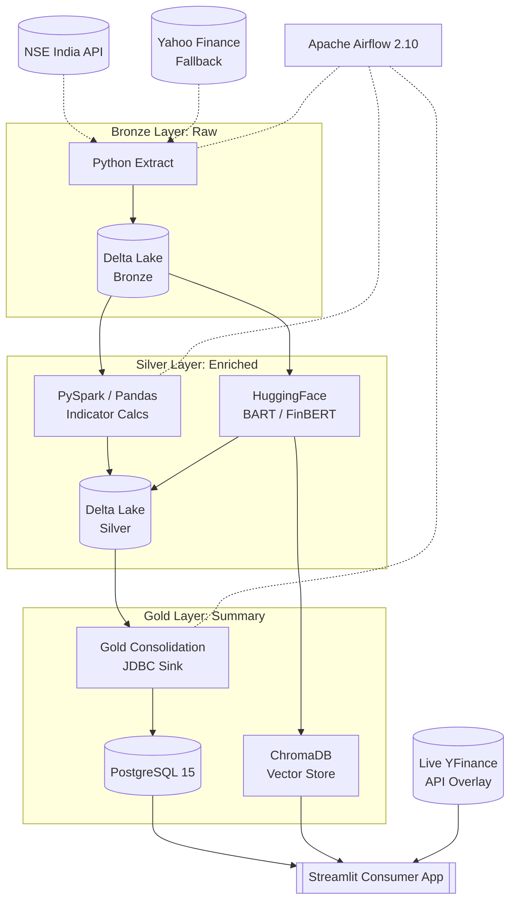

# FinScope: Institutional-Grade NSE Stock Market Platform

A professional-grade equity research platform combining a **Retail-Ready Consumer Frontend** with a **Medallion Architecture** (Bronze/Silver/Gold) Big Data stack. This platform handles daily batch ingestion from NSE, distributed analytical processing via PySpark, and houses a **Machine Learning Core** for financial sentiment analysis and RAG-powered stock insights—all served through a premium, jargon-free Streamlit dashboard with real-time live-tick overlays.

## 🏗️ Architecture (Medallion Flow)



## 🛠️ Technology Stack

- **Frontend Application:** Streamlit (Vanilla CSS, Plotly Subplots, Auto-Refresh)
- **Data Lake:** [Delta Lake](https://delta.io/) (ACID Transactions on Parquet)
- **Big Data Computing:** [Apache Spark 4.0.1](https://spark.apache.org/) (Vectorized `applyInPandas` processing)
- **Vector Database:** [ChromaDB](https://www.trychroma.com/) (RAG-powered stock analysis)
- **Machine Learning:** HuggingFace Transfer Learning (**BART** for Summarization, **FinBERT** for Sentiment)
- **Orchestration:** [Apache Airflow](https://airflow.apache.org/)
- **Database:** [PostgreSQL 15](https://www.postgresql.org/) (Analytical Gold Layer)
- **DevOps:** Docker Compose (Full-stack containerization)

## 💎 Project Highlights (Why this is Portfolio-Ready)

- **Institutional UX/UI:** Stripped away all technical pipeline jargon to present a clean, highly-polished retail platform mimicking high-end equity terminals, complete with a dedicated landing page.
- **Real-Time Market Overlay:** The dashboard seamlessly merges daily PySpark batch data (Airflow/PostgreSQL) with a 15-second auto-refreshing live market tick overlay via asynchronous `yfinance` caching.
- **Live AI Analyst Translations:** Automatically translates rigid financial multiples (P/E ratios, Price-to-Book, 52-week positions) into dynamic, plain-English executive summaries on the fly.
- **Vectorized Technical Analysis:** Implemented RSI, SMA, and Volatility indicators using Spark's `applyInPandas` for 10x performance over row-based processing.
- **Production Resilience:** Robust `yfinance` fallback logic automatically engages if official NSE API limits are reached, ensuring 24/7 data availability.
- **Statistical Integrity:** Integrated Z-Score based outlier detection (Rule 7) to automatically flag and filter "fat-finger" trades and flash-crash anomalies.
- **RAG Integration:** A dedicated "Ask Questions" module uses `sentence-transformers` locally (no API cost) to index news headlines into ChromaDB for semantic search.
- **Clean Registry:** 134+ comprehensive unit tests ensuring pipeline idempotency and data contract enforcement across all layers.

## 🚀 Quickstart & Verification

### 1. Environment Setup
```bash
# Spin up the full Big Data stack
docker-compose up -d

# Initialize schemas and roles
docker exec finscope_airflow_scheduler python -m backend.pipeline.db_init
```

### 2. Run the Pipeline
The pipeline is fully orchestrated by Airflow, but can be manually triggered:
```bash
# Execute Full Ingestion & Transformation
docker exec finscope_airflow_scheduler bash -c \
  "python -m backend.pipeline.extract && python -m backend.pipeline.transform"

# Run ML Analysis (Earnings Summarization)
docker exec finscope_airflow_scheduler python -m backend.pipeline.earnings_ingest
```

### 3. Launch UI
```bash
# Ensure POSTGRES_HOST=localhost and CHROMADB_HOST=localhost in .env
# Run locally using your virtual environment
.\venv\Scripts\python.exe -m streamlit run frontend/app.py
```

## 🔒 Engineering Best Practices

1. **Idempotent DAGs:** Every task uses `UPSERT` (ON CONFLICT) logic; re-running any stage never duplicates data.
2. **Secrets Management:** Airflow variables and `.env` files ensure zero leakage of API tokens (NewsAPI/HF).
3. **Medallion Integrity:** Data contracts are strictly enforced via Pydantic models at the Bronze-to-Silver ingress.
4. **Resilient ML:** Sentiment analysis includes a 1s backoff/retry-loop for reliable communication with HuggingFace Hub.
